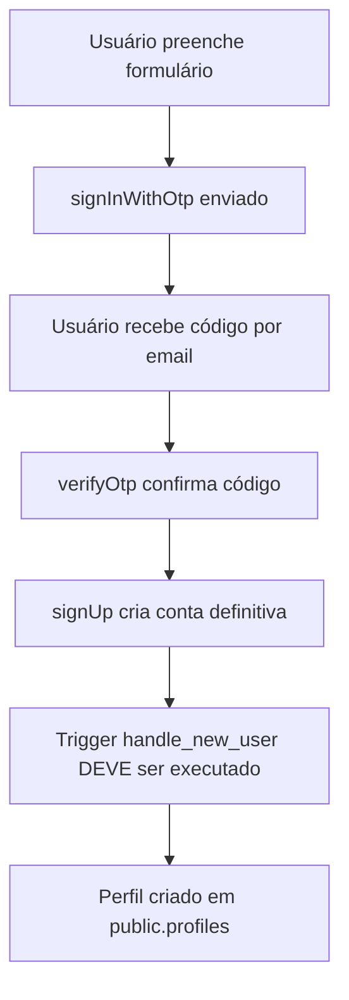

# 🔍 Verificação de Dados de Usuários

## 📋 **Como Verificar se os Dados Estão Sendo Salvos**

### **1️⃣ Verificação no Supabase Dashboard**

Execute o script `verificar_usuarios.sql` no Supabase Dashboard:

1. Acesse [Supabase Dashboard](https://supabase.com/dashboard)
2. Vá em **"SQL Editor"**
3. Cole o conteúdo de **`verificar_usuarios.sql`**
4. Execute o script
5. Analise os resultados

### **2️⃣ Verificação no Frontend (Opcional)**

Para testar diretamente no app, adicione temporariamente o componente:

```tsx
// No arquivo src/pages/Index.tsx, adicione:
import { VerificarUsuarios } from '@/components/VerificarUsuarios';

// E no JSX, adicione:
<VerificarUsuarios />
```

### **3️⃣ O que Verificar**

#### ✅ **Dados que DEVEM estar sendo salvos:**

1. **Na tabela `auth.users`:**
   - ID do usuário
   - Email
   - Data de confirmação (`email_confirmed_at`)
   - Metadados (`raw_user_meta_data` com nome)

2. **Na tabela `public.profiles`:**
   - ID do perfil
   - `user_id` (referência para `auth.users`)
   - Nome extraído dos metadados
   - Email copiado de `auth.users`

#### ❌ **Problemas Comuns:**

1. **Usuários sem perfil:** Trigger `handle_new_user` não funcionando
2. **Metadados vazios:** Nome não sendo passado no cadastro
3. **RLS bloqueando:** Políticas muito restritivas
4. **Foreign key ausente:** Tabelas não vinculadas corretamente

### **4️⃣ Fluxo Atual de Cadastro**



### **5️⃣ Pontos de Falha Possíveis**

1. **Trigger não existe ou está desabilitado**
2. **Função `handle_new_user` com erro**
3. **RLS bloqueando inserção na tabela `profiles`**
4. **Metadados não sendo salvos no `signUp`**
5. **Foreign key constraint falhando**

### **6️⃣ Como Corrigir**

Se o problema for identificado:

1. **Execute o script `recreate_tables.sql`** para recriar tudo corretamente
2. **Teste o cadastro novamente** com um email novo
3. **Verifique os logs** no console do navegador
4. **Use o componente de verificação** para debugar

### **7️⃣ Verificação Manual Rápida**

No Supabase Dashboard > SQL Editor, execute:

```sql
-- Contar usuários vs perfis
SELECT 
  'Usuários auth' as tipo, COUNT(*) as total 
FROM auth.users WHERE email_confirmed_at IS NOT NULL
UNION ALL
SELECT 
  'Perfis criados' as tipo, COUNT(*) as total 
FROM public.profiles;

-- Se os números não baterem, há problema no trigger!
```

Execute essas verificações e me informe os resultados! 🔍